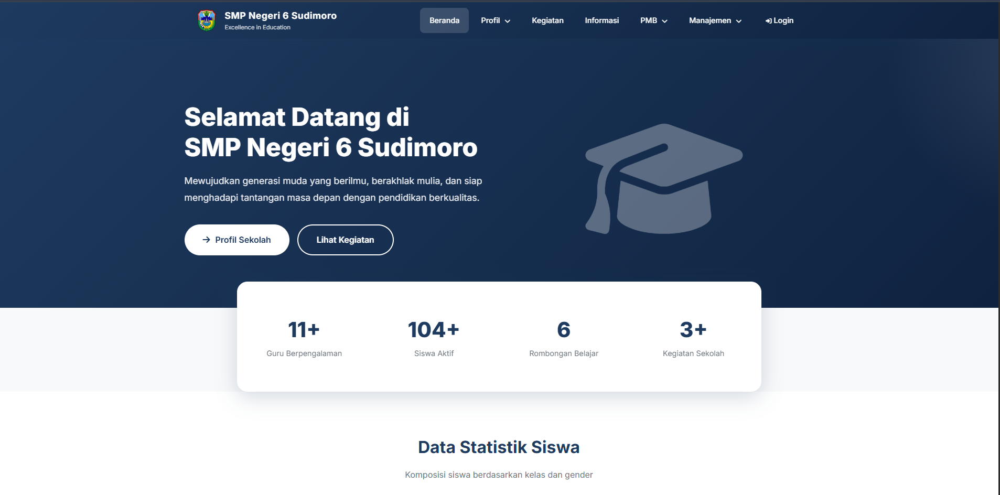
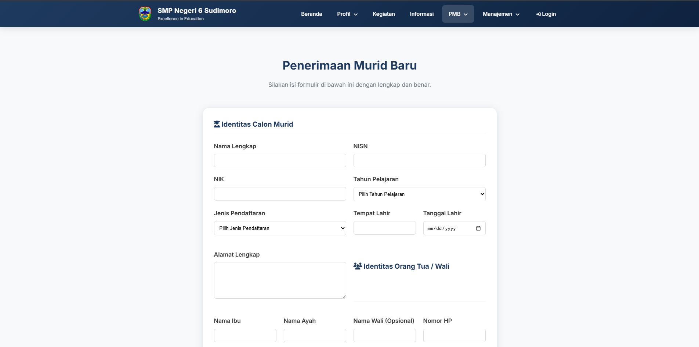
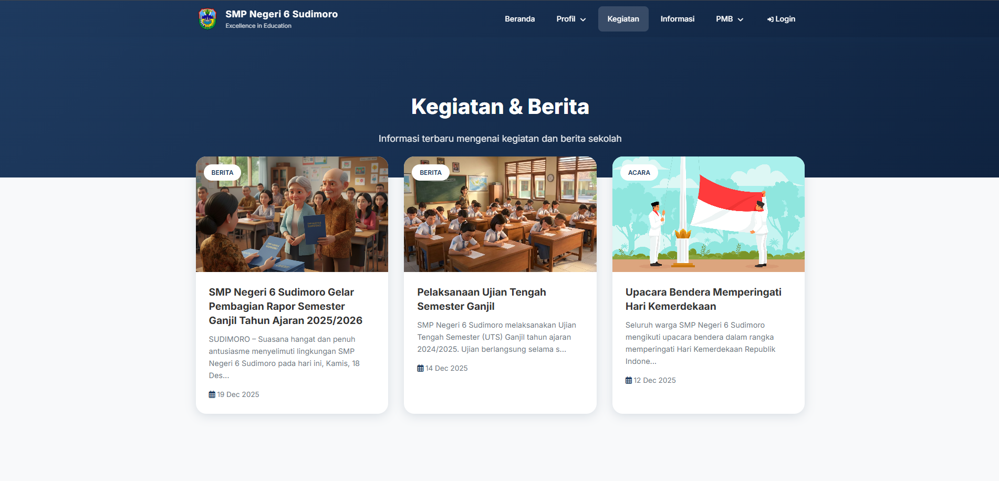
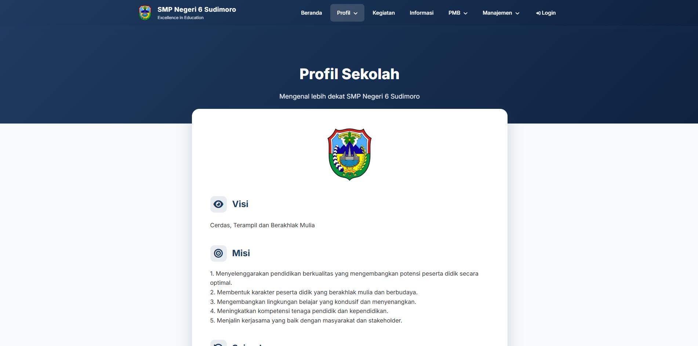
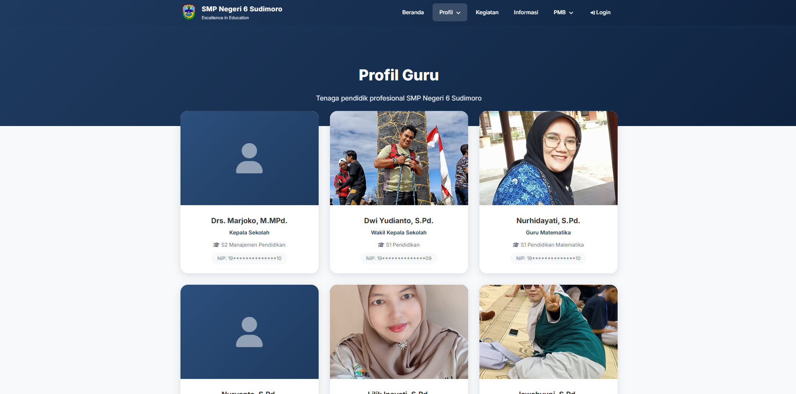
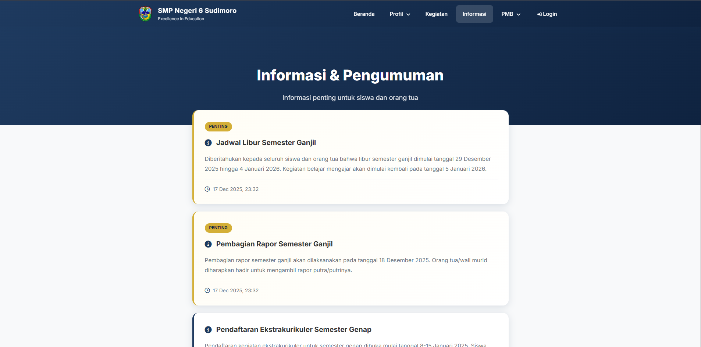
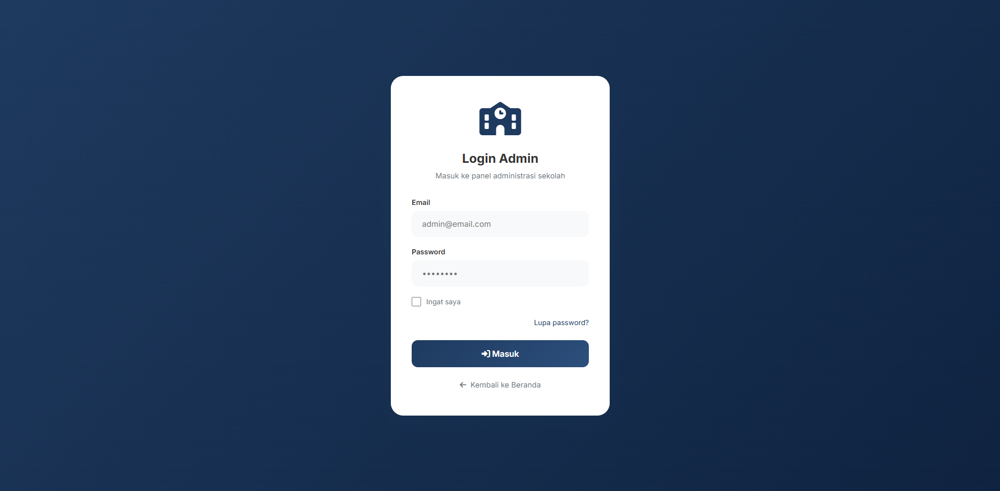

# 🏫 Webskul - Modern School Management System

A comprehensive, elegant, and responsive school website and management system built with **Laravel 12**, **MySQL**, and **Vite**. Designed specifically for SMP Negeri 6 Sudimoro, but flexible enough for any educational institution.


---

## ✨ Key Features

### 🌐 Frontend (Public Portal)

- **Modern UI/UX**: Elegant navy blue and white design with smooth animations.
- **Dynamic Content**: Home page with hero sections, statistics, and floating announcements.
- **School Identity**: Detailed profile including vision, mission, and history.
- **Teacher Directory**: Visual gallery of teachers and staff.
- **News & Activities**: Paginated news blog with high-quality image support.
- **PMB (Penerimaan Murid Baru)**:
    - Online student registration with unique registration numbers.
    - Registration status check page.
    - Downloadable PDF registration proof with QR codes.
    - Session-based popup notifications for active registration periods.
- **Responsive Branding**: Dynamic favicon and logos manageable via admin panel.

### 🔐 Backend (Admin Panel)

- **Advanced Dashboard**: Real-time statistics for students, teachers, and activities.
- **Content Management**: Full CRUD for News, Information, and School Profile.
- **Teacher & Student Management**: Detailed records including photo uploads and CSV/Excel exports.
- **PMB Management**:
    - Centralized registration list with advanced search (DataTables).
    - Unique NISN/NIK validation to prevent duplicate entries.
    - Exportable registrant data.
- **System Settings**:
    - **SMTP Configuration**: Integrated testing tool for email delivery.
    - **System Updates**: One-click updates directly from GitHub.
    - **Backup & Maintenance**: Tools for clearing cache and optimizing the application.
- **Security**: Base64 image encoding for reliable storage, password hashing, and role-based access.

---

## � Visual Previews

### Public Portal (Frontend)

|          Home Page          | Student Registration (PMB) |        News & Activities        |
| :-------------------------: | :------------------------: | :-----------------------------: |
|  |         |  |

|           School Profile           |        Teacher Directory         |         Information Board         |
| :--------------------------------: | :------------------------------: | :-------------------------------: |
|  |  |  |

### Administrative Panel (Backend)

|       Dashboard Overview        |     Login Interface     |
| :-----------------------------: | :---------------------: |
|  |  |

---

## �📋 System Requirements

To run this project locally or on a server, ensure you meet the following requirements:

| Component           | Minimum Version      |
| ------------------- | -------------------- |
| **PHP**             | 8.2 or higher        |
| **Composer**        | 2.5 or higher        |
| **MySQL / MariaDB** | 8.0 / 10.4 or higher |
| **Node.js**         | 20.x or higher       |
| **NPM**             | 10.x or higher       |

### Required PHP Extensions:

`bcmath`, `ctype`, `fileinfo`, `gd`, `json`, `mbstring`, `openssl`, `pdo_mysql`, `tokenizer`, `xml`, `zip`

---

## 🚀 Installation & Setup

Follow these steps to get your development environment running:

### 1. Clone the Repository

```bash
git clone https://github.com/aangwie/webskul.git
cd webskul
```

### 2. Install Backend Dependencies

```bash
composer install
```

### 3. Install Frontend Dependencies

```bash
npm install
npm run build
```

### 4. Configuration

Copy the example environment file and generate a unique application key:

```bash
cp .env.example .env
php artisan key:generate
```

### 5. Database Setup

1. Create a new database in MySQL (e.g., `webskul_db`).
2. Update your `.env` file with your database credentials:

```env
DB_CONNECTION=mysql
DB_HOST=127.0.0.1
DB_PORT=3306
DB_DATABASE=webskul_db
DB_USERNAME=root
DB_PASSWORD=your_password
```

### 6. Run Migrations & Seeders

This will create the necessary tables and populate the default admin account:

```bash
php artisan migrate --seed
```

### 7. Storage Initialization

Create a symbolic link from `public/storage` to `storage/app/public`:

```bash
php artisan storage:link
```

### 8. Start the Application

```bash
php artisan serve
```

Visit the application at: `http://127.0.0.1:8000`

---

## 🔑 Default Credentials

After seeding, you can log in to the admin panel:

- **Login URL**: `http://127.0.0.1:8000/login`
- **Email**: `admin@smpn6sudimoro.sch.id`
- **Password**: `password123`

> [!IMPORTANT]
> Immediately change the default password in the **Profil Admin** section after your first login.

---

## 🛠️ Configuration Guide

### SMTP (Email) Setup

To enable password resets and notifications:

1. Go to **Pengaturan SMTP** in the Admin Sidebar.
2. Fill in your provider details (Gmail, Mailtrap, etc.).
3. Click **Simpan & Test Koneksi** to ensure settings are correct.

### GitHub Updates

To use the "Update dari Github" feature:

1. Generate a **GitHub Personal Access Token** (Fine-grained or Classic).
2. Add it to your `.env`: `GITHUB_TOKEN=your_token_here`.
3. Ensure Git is installed and configured on your server path.

---

## 📁 Project Structure

```text
webskul/
├── app/Http/Controllers/   # Logic for Frontend and Admin
├── app/Models/             # Eloquent Database Models
├── database/migrations/    # Database Schema Definitions
├── public/                 # Assets (CSS/JS/Images)
├── resources/views/        # Blade Templates (Admin & Frontend)
├── routes/web.php          # Main URL routing
└── storage/                # Logs and File Uploads
```

---

## 📝 License

This project is licensed under the [MIT License](LICENSE).

## 👨‍💻 Author

**Aang Wirawan**

- GitHub: [@aangwie](https://github.com/aangwie)
- Built with ❤️ for Education.
